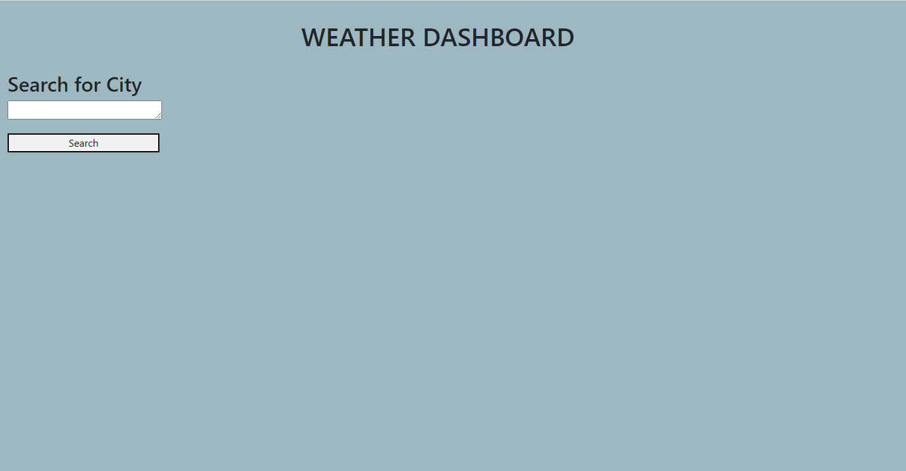
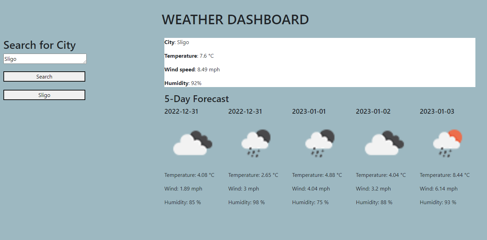
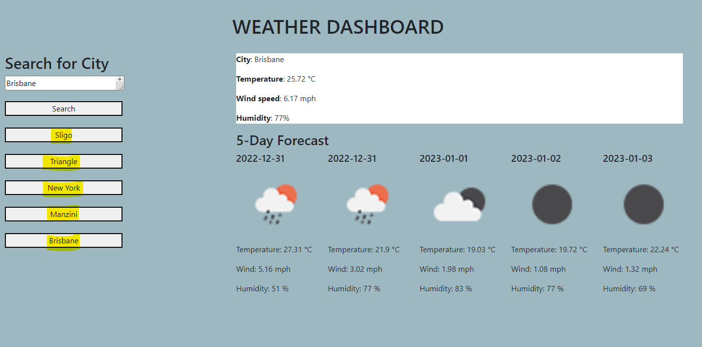

# fiveDayWeatherOutlook
## Description

Using an the weathermap API, as part of the course requirements for the UNB Fullstack Web Development Bootcamp, I have created a weather app/ "Weather Daashboard".
This allows the user to input any City, and the app will return (from data extracted from the Weathermap API) the current weather and the 5 day weather forcast. Previous searched will be saved to local storage, with the last 5 Cities being displayed on the screen. 

## Installation

N/A

## Usage

- Upon opening the page you will see the landing page which welcomes the user and gives them instructions on how to use the app. 
- The user can enter a City name in the search bar provided & click on search to prompt the app to fetch data from the Weathermap API
- Data pertaining to the current & five day weather forecast will be displayed along with images of current and predicted conditions. 
- The City searched for will then be stored as a button to enhance the user experience by allowing them to search for this City's 
  data at the click of a button. A maximum of 5 cities will be displayed. 

## Credits

-N/A

## License

Please refer to LICENSE in the repo
